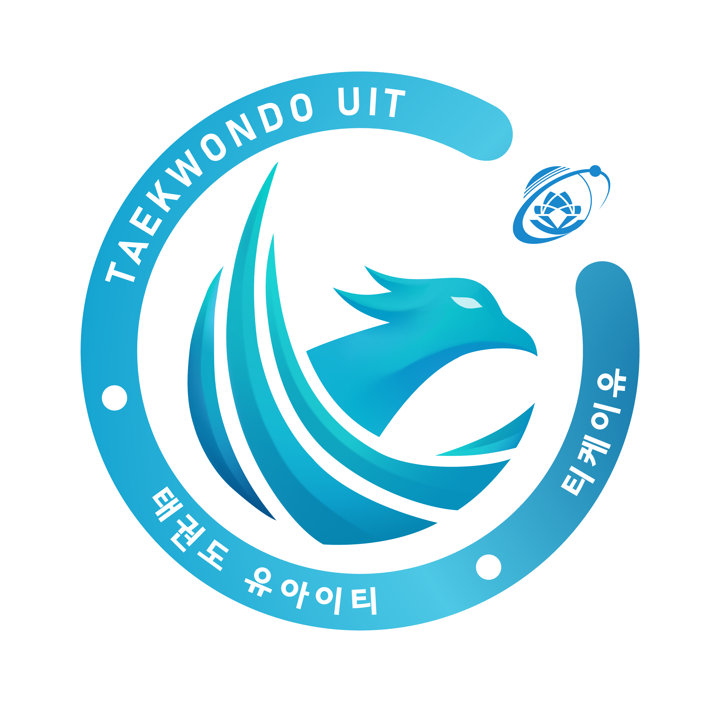

<h1>🥋 TKU KampfPortal 🥋</h1>

  
  

  
<b>University of Information Technology</b> • <b>Taekwondo UIT Club</b>

## 📜 About Us

**TKU KampfPortal** is a development team created by members of the Taekwondo UIT Club at the University of Information Technology - Vietnam National University Ho Chi Minh City. Established in March 2025, our mission is to develop digital solutions that serve the club's operations while creating a professional learning environment for our members.

## 🚀 Our Projects

### 🖥️ TKU KampfPortal (TKP)

A comprehensive management platform with two main components:

- **Admin Portal**: Complete member management system for club leadership
- **Member Portal**: Interface for members to submit leave requests, view announcements, and more

### 👤 Attendance FaceID

Automated attendance tracking system using facial recognition technology to streamline club participation records.

### ⚔️ Sparring

Application designed to support training sessions and competitions, enhancing the technical development of club members.

## 🌟 Our Vision

Beyond creating software for the Taekwondo UIT Club, TKU KampfPortal aims to:

- 📚 Provide hands-on learning opportunities for students to apply academic knowledge
- 👨‍💻 Foster professional development through code reviews and documentation
- 🤝 Create a supportive environment for skill growth and collaboration
- 🛠️ Develop practical solutions that address real-world club management challenges

## 📫 Contact

  

    📧 <a href="mailto:taekwondo.uit.vnu@gmail.com">taekwondo.uit.vnu@gmail.com</a>
  

  

    📱 <a href="https://www.facebook.com/uittaekwondo">@uittaekwondo</a>
  

  

    📍 <a href="https://maps.app.goo.gl/oZbAj4Zb91FVcggv5">University of Information Technology, VNU-HCM</a>
  

---

⚡ Powered by the spirit of Taekwondo and the passion for technology ⚡

